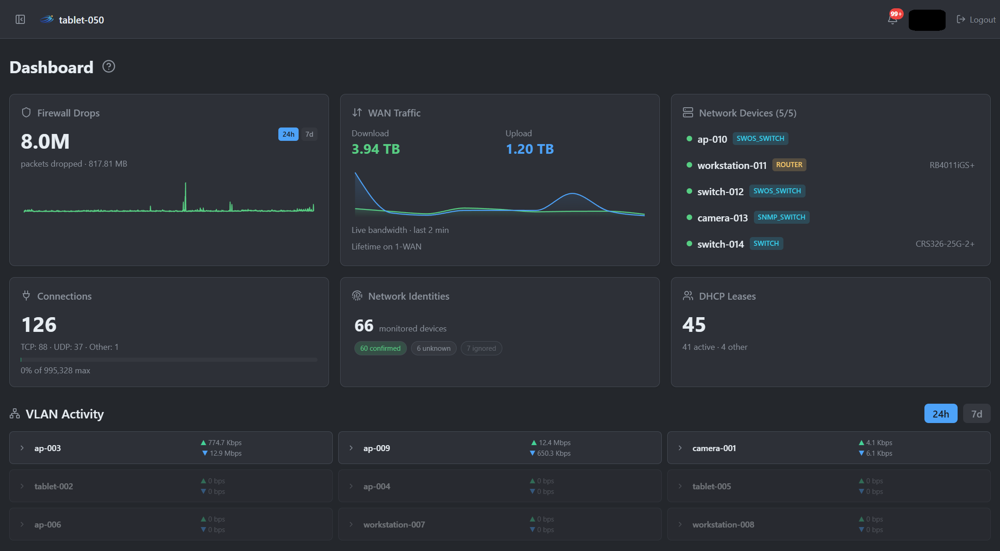
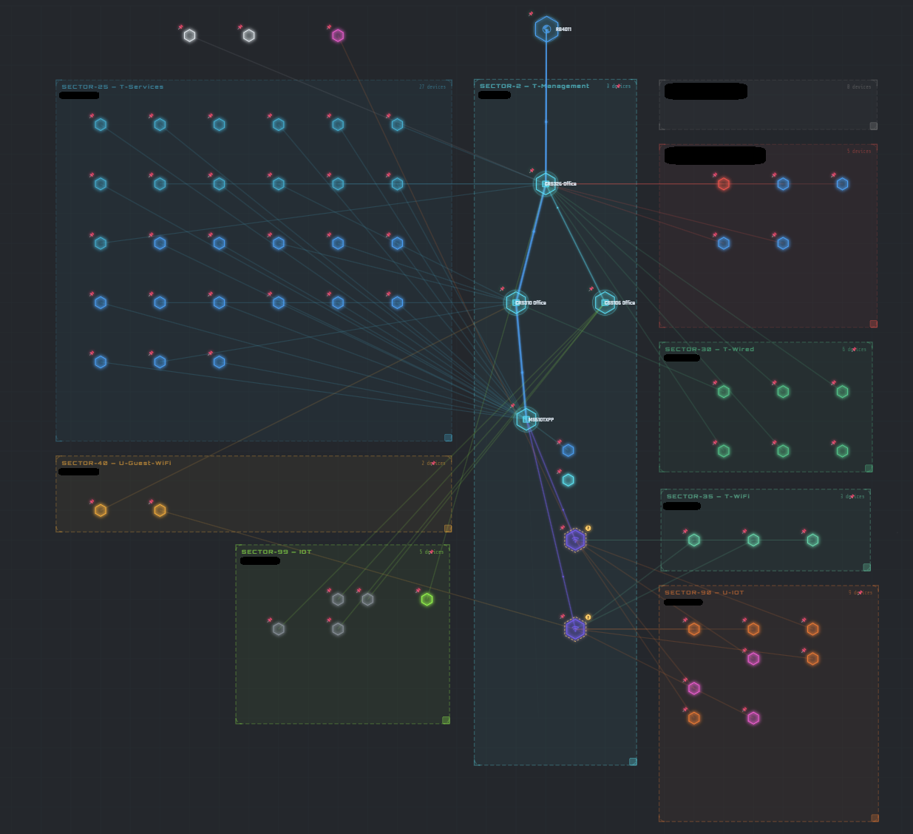
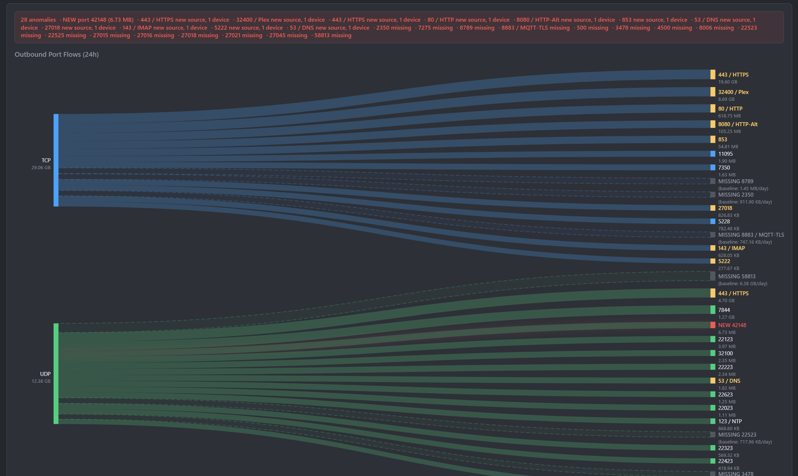
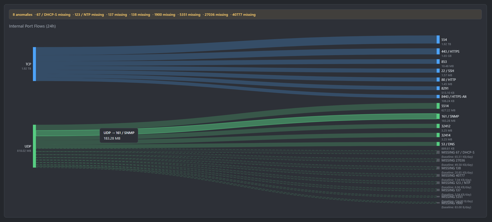
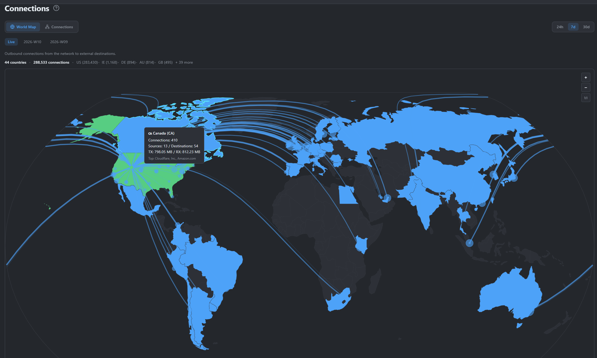
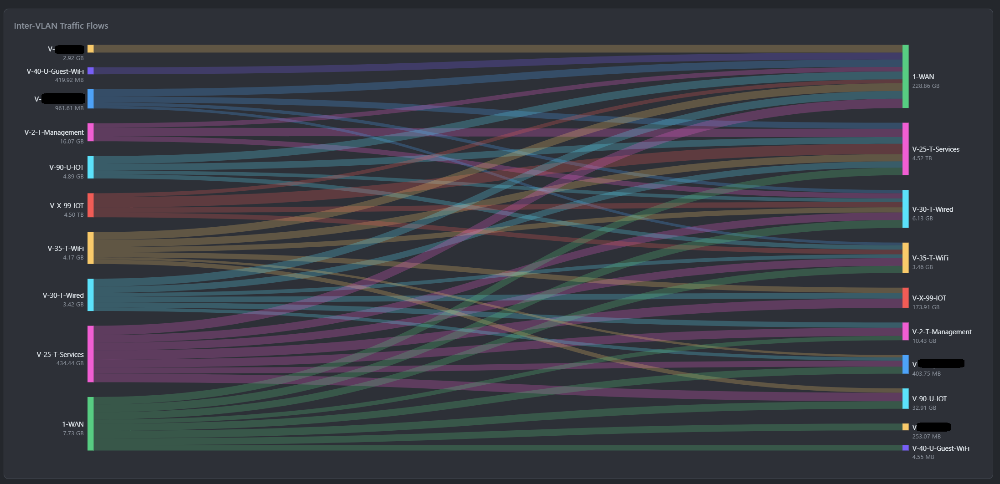
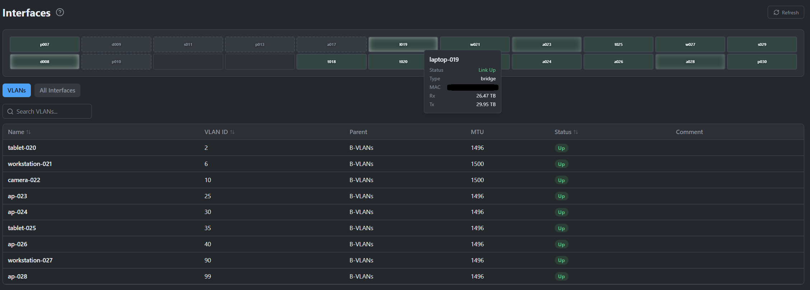
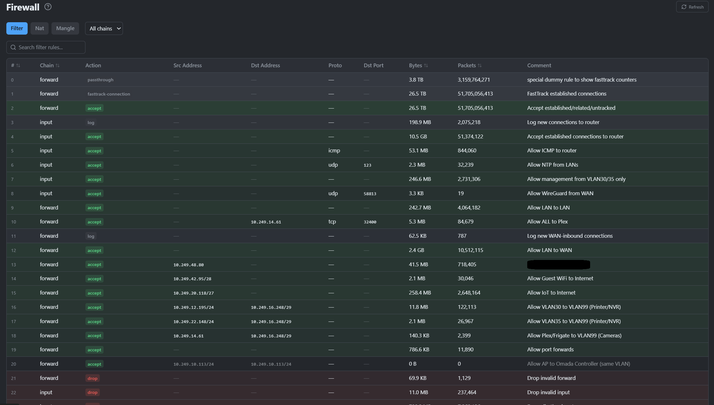

<p align="center">
  
</p>

<p align="center">
  Network monitoring, security analytics, and device management for MikroTik RouterOS networks.<br>
  Built in Rust with a React frontend.
</p>

---



## What It Does

Ion Drift connects to your MikroTik router's REST API, monitors your network in real time, learns what's normal, and alerts you when something changes. It tracks every connection, fingerprints every device, maps your topology, and gives you Sankey flow diagrams to investigate traffic patterns.

See [FEATURES.md](FEATURES.md) for the full feature list.

### Policy Deviation Detection

- **DNS Policy Deviation Detection** — Detects devices using unauthorized DNS servers by cross-referencing connection tracking with the infrastructure policy map. Enriched with MITRE ATT&CK technique context. Resolve actions create policies organically from observed traffic.
- **NTP Policy Deviation Detection** — Detects devices using unauthorized NTP servers. ATT&CK technique T1124 (System Time Discovery). Policies auto-synced from DHCP option 42.
- **Policy Editor** — Create custom network policies directly. Admin policies survive router sync cycles. Router-synced policies are read-only with lock icon.

## Screenshots

### Network Topology
Auto-discovered network topology driven by a resolved infrastructure snapshot from the correlation engine. VLAN grouping, device classification, and switch-level attachment inference with unified LLDP device resolution (6-step precedence) and evidence chains.



### Sankey Flow Investigation
Multi-level drill-down: network overview, per-VLAN device flows, per-device protocol/destination breakdown, and conversation detail.




### World Map
GeoIP-enriched connection visualization with country and city summaries, flagged region monitoring, and arc overlays.



### VLAN Traffic Flows
Inter-VLAN traffic volumes with real-time activity tracking.



### Interfaces
Live interface status with traffic rates, MTU, MAC addresses, and link state.



### Firewall
Firewall rule viewer with drop statistics and geo-enriched drop country attribution.



### Policy Deviations
Detects devices using unauthorized DNS and NTP servers by cross-referencing connection tracking with your router's DHCP and DNS configuration. Every deviation is enriched with [MITRE ATT&CK](https://attack.mitre.org/) technique context. Resolve actions — Authorize, Acknowledge, Flag All, Dismiss — create policies organically from observed traffic. Custom policies can be created via the built-in policy editor.

On our own production network, the deviation detector flagged our authoritative DNS server for performing recursive resolution directly to root servers — bypassing our AdGuard ad-filtering pipeline entirely. A misconfiguration we'd missed for months, found and fixed in 20 minutes. If it catches that on a network run by the developers, it'll catch IoT devices hardcoding `8.8.8.8` on yours.

<!--  -->

## System Requirements

### Pre-built Docker Image (recommended)

| Resource | Minimum | Recommended |
|----------|---------|-------------|
| CPU | 1 vCPU | 2+ vCPU |
| RAM | 512 MB | 1 GB |
| Disk | 500 MB | 2 GB (grows with connection history) |
| Docker | 20.10+ | Latest stable |

### Building from Source

Compiling Rust in release mode is resource-intensive. Do not attempt to build on low-spec VMs.

| Resource | Minimum | Recommended |
|----------|---------|-------------|
| CPU | 4 vCPU | 8+ vCPU |
| RAM | 4 GB | 8 GB |
| Disk | 10 GB free | 20 GB free |
| Rust | 1.75+ (via [rustup](https://rustup.rs)) | Latest stable |
| Node.js | 20+ | 22 LTS |

The release build can take 10-30 minutes depending on hardware. With less than 4GB of RAM, the Rust compiler will likely be killed by the OOM killer.

## Quick Start

**Before you start,** have these ready:
- Your MikroTik router's hostname or IP address
- A dedicated RouterOS API user with `api,read` policies (see [Router User Setup](#router-user-setup) below)
- The router must have HTTPS enabled on port 443 with a TLS certificate

**Step 1: Set up the config**

```bash
cp docker-compose.example.yml docker-compose.yml
mkdir -p config
cp config/production.example.toml config/production.toml
```

Edit `config/production.toml` — fill in the `[router]` section for your environment:

```toml
[router]
host = "your-router.example.com"   # hostname or IP — must match TLS certificate
port = 443
tls = true
ca_cert_path = ""                  # set to "/app/certs/root_ca.crt" for private CA
username = "ion-drift"
wan_interface = "ether1"           # your router's WAN-facing interface name
```

Then uncomment the config mount in `docker-compose.yml`:

```yaml
volumes:
  - ./config/production.toml:/app/config/server.toml:ro
```

If your router uses a private CA (Smallstep, EJBCA, self-signed), set `ca_cert_path` and mount the CA cert. See [docs/configuration.md](docs/configuration.md#first-run) for details. If your router uses Let's Encrypt or another public CA, leave `ca_cert_path` empty.

**Step 2: Start and set up**

```bash
docker compose up -d
```

Open `http://your-host:3000` in your browser. The setup wizard guides you through initial configuration:

1. **Create admin account** — choose a username and strong password (min 12 characters). This is your Ion Drift login, not your router password.
2. **Log in** — after the wizard completes, click "Access Ion Drift" and log in with the credentials you just created.
3. **Add your router** — go to Settings → Devices. Enter your router credentials (username and password). Ion Drift begins monitoring immediately.

No environment variables or build tools needed. Credentials are stored encrypted — never put passwords in config files or Docker environment variables.

Pre-built images are published to `ghcr.io/cyber-hive-security/ion-drift` on every release.

### Router User Setup

Create a dedicated read-only user on your MikroTik router — **do not use the admin account:**

```routeros
/user group add name=ion-drift policy=api,read,!write,!ftp,!local,!telnet,!ssh,!reboot,!policy,!test,!winbox,!password,!web,!sniff,!sensitive,!romon,!rest-api
/user add name=ion-drift group=ion-drift password=YourStrongPasswordHere
```

Ion Drift uses the **REST API on port 443** (HTTPS). Do not use port 8728 or 8729 — those are the RouterOS proprietary API (Winbox/API), a completely different protocol.

## SNMP Managed Switches

Ion Drift can monitor managed switches via SNMP (v2c or v3) alongside your MikroTik router. Add switches through **Settings → Devices** with device type "SNMP Switch."

**Vendor profiles** control how Ion Drift interprets each switch's SNMP data — interface naming, port classification, hidden index filtering, and counter support. Without a profile, the generic fallback works but interface names and port groupings may render incorrectly.

| Vendor | Status |
|--------|--------|
| Netgear (ProSafe) | Supported — dedicated profile |
| HPE/Aruba (2540 series) | Supported — dedicated profile |
| Cisco Small Business (SG550X, SG350X, SG250X) | Supported — dedicated profile |
| All others | Generic fallback — functional but may have display quirks |

To help us build a profile for your switch, see [docs/snmp-profiles.md](docs/snmp-profiles.md).

## Optional: OIDC Single Sign-On

Ion Drift works with any OpenID Connect provider (Keycloak, Authentik, Authelia). To enable SSO, add an `[oidc]` section to your config file. See [docs/configuration.md](docs/configuration.md) for provider-specific setup guides.

## Architecture

```
ion-drift/
├── crates/
│   ├── mikrotik-core/       # RouterOS REST + SNMP + SwOS client library
│   ├── ion-drift-storage/   # SQLite stores (behavior, switch, metrics, traffic)
│   ├── ion-drift-cli/       # CLI binary (clap)
│   └── ion-drift-web/       # Axum web server + background tasks
├── web/                     # React frontend (Vite + TypeScript + TanStack)
├── config/                  # Configuration templates (TOML)
└── docs/                    # Technical documentation and engine whitepapers
```

**Tech stack:** Rust (Axum, Tokio, SQLite), React 19 (Vite, TypeScript, TanStack Router + Query, Recharts, D3.js, Tailwind CSS 4)

Uses the RouterOS v7 REST API over HTTPS. Switch management supports RouterOS, SwOS, and SNMP v2c/v3.

## Docker Deployment

```bash
cp docker-compose.example.yml docker-compose.yml
docker compose up -d
```

Optional bind-mounts (uncomment in docker-compose.yml as needed):
- `config/server.toml` → `/app/config/server.toml` (custom config — setup wizard handles first-run without it)
- `certs/root_ca.crt` → `/app/certs/root_ca.crt` (only if your router or OIDC provider uses a private CA)
- `ion-drift-data` volume → `/app/data` (SQLite databases, GeoIP data, encryption keys)

## Building from Source

If you need to build from source instead of using the pre-built image:

```bash
# Install Rust (if not already installed)
curl --proto '=https' --tlsv1.2 -sSf https://sh.rustup.rs | sh
source ~/.cargo/env

# Install Node.js 22 (if not already installed)
# See https://nodejs.org/ or use your package manager

# Clone and build
git clone https://github.com/Cyber-Hive-Security/ion-drift.git
cd ion-drift

# Build the Rust backend (release mode — requires 8GB+ RAM)
cargo build --release --bin ion-drift-web

# Build the frontend
cd web
npm ci
npm run build
cd ..

# Run
./target/release/ion-drift-web --config config/server.toml
```

To build as a Docker image from source:

```bash
# Requires 4+ vCPU and 4+ GB RAM available to Docker
docker compose -f docker-compose.build.yml up -d
```

> **Note:** If building fails or the process is killed, your host likely doesn't have enough resources. Use the pre-built image instead — just run `docker compose up -d`. See [Quick Start](#quick-start).

## Configuration

Configuration is optional for getting started. The setup wizard handles initial setup.

For advanced configuration (OIDC, syslog, CertWarden, custom bind address), see [docs/configuration.md](docs/configuration.md).

## Documentation

- [FEATURES.md](FEATURES.md) — Complete feature list
- [CHANGELOG.md](CHANGELOG.md) — Release history
- [SECURITY.md](SECURITY.md) — Vulnerability reporting policy
- [docs/troubleshooting.md](docs/troubleshooting.md) — Common issues and solutions
- [docs/configuration.md](docs/configuration.md) — Configuration reference with OIDC provider guides
- [docs/auth.md](docs/auth.md) — Authentication architecture
- [docs/behavior-engine-whitepaper.md](docs/behavior-engine-whitepaper.md) — Anomaly detection engine
- [docs/topology-engine-whitepaper.md](docs/topology-engine-whitepaper.md) — Network topology inference
- [docs/investigation-engine-whitepaper.md](docs/investigation-engine-whitepaper.md) — Automated investigation engine
- [docs/correlation-engine-whitepaper.md](docs/correlation-engine-whitepaper.md) — Identity correlation engine
- [docs/connection-store-whitepaper.md](docs/connection-store-whitepaper.md) — Connection tracking and GeoIP
- [docs/policy-editor.md](docs/policy-editor.md) — Policy editor and deviation detection guide
- [docs/deviation-limitations.md](docs/deviation-limitations.md) — Detection visibility boundaries and evasion techniques
- [docs/router-setup.md](docs/router-setup.md) — MNDP configuration, API user setup, and provisioning overview

## Security

- Secrets encrypted at rest (AES-256-GCM)
- Local auth with argon2id password hashing, or OIDC with any provider
- HMAC-SHA256 signed sessions with HttpOnly/Secure cookies
- CSRF protection, rate limiting, security headers
- No telemetry, no phone-home — runs fully air-gapped

See [SECURITY.md](SECURITY.md) for reporting vulnerabilities.

## AI Development Disclosure

Ion Drift was built entirely by AI coding agents under the direction and architectural guidance of [Scott Baird](https://github.com/scott-chs), founder of Cyber Hive Security LLC.

100% of the source code — backend, frontend, CLI, database schemas, authentication system, behavioral analytics engines, topology inference, and all supporting infrastructure — was written by [Claude Code](https://claude.ai/claude-code) (Anthropic) and [Codex](https://openai.com/codex) (OpenAI). This includes:

- All Rust backend code (Axum web server, RouterOS/SNMP/SwOS clients, SQLite storage, AES-256-GCM encryption, OIDC and local auth)
- All React/TypeScript frontend code (dashboard, topology map, Sankey diagrams, settings UI)
- Security reviews, code audits, and vulnerability remediation
- Refactoring, performance optimization, and architectural decisions
- Documentation, engine whitepapers, and configuration guides
- Licensing system, setup wizard, and deployment infrastructure
- Docker packaging and CI/CD configuration

No line of code was written by a human. Human contribution was limited to product vision, architecture direction, feature prioritization, acceptance testing, and deployment into the production homelab environment where Ion Drift runs today.

This project demonstrates that AI coding agents can produce production-grade, security-conscious software when guided by a knowledgeable operator who understands the problem domain.

## License

[PolyForm Shield License 1.0.0](LICENSE) with the [Cyber Hive Security Use Agreement](USE-AGREEMENT).

**Personal home use is free.** Commercial use requires a license from [Cyber Hive Security](https://www.mycyberhive.com/license).

Copyright (c) 2026 Cyber Hive Security LLC
